# 1. High-level architecture

```mermaid 
graph LR
    %% --- STYLE DEFINITIONS ---
    classDef storage fill:#E3F2FD,stroke:#1565C0,stroke-width:2px,color:#0D47A1;
    classDef compute fill:#FFF3E0,stroke:#EF6C00,stroke-width:2px,color:#E65100;
    classDef logic fill:#F3E5F5,stroke:#7B1FA2,stroke-width:2px,color:#4A148C;
    classDef alert fill:#FFEBEE,stroke:#C62828,stroke-width:2px,color:#B71C1C;
    classDef user fill:#E8F5E9,stroke:#2E7D32,stroke-width:2px,color:#1B5E20;

    %% --- 1. SOURCE SYSTEM ---
    subgraph CRM_Env ["1. CRM Ecosystem"]
        direction TB
        SFDC[("Salesforce DB")]:::storage
        Trigger(("🕒 Daily<br/>06:00 AM")):::compute
    end

    %% --- 2. THE GUARDIAN ENGINE ---
    subgraph SkyGeni ["2. SkyGeni Guardian Engine"]
        direction TB
        ETL["Python ETL Worker"]:::compute
        
        %% The Logic Chain (Aligned with Code)
        subgraph Decision_Pipeline ["Risk Scoring Pipeline"]
            direction TB
            R1("Rule 1:<br/>Rot Check"):::logic
            R2("Rule 2:<br/>Velocity Check"):::logic
            R3("Rule 3:<br/>Cohort Check"):::logic
            R4("Rule 4:<br/>Hygiene Check"):::logic
            
            Sum["Sum Risk Score<br/>(0 to 100)"]:::compute
        end
    end

    %% --- 3. ACTION LAYER ---
    subgraph Outputs ["3. Action Layer"]
        direction TB
        Slack["🚨 Slack Alert<br/>'Zombie Deal'"]:::alert
        Email["📧 Weekly<br/>Digest"]:::user
        WriteBack["✍️ Update CRM<br/>Field"]:::storage
    end

    %% --- DATA FLOW ---
    Trigger -->|Wake Up| ETL
    ETL <-->|Fetch Open Deals| SFDC
    
    ETL --> R1
    R1 --> R2
    R2 --> R3
    R3 --> R4
    R4 --> Sum
    
    Sum -->|Score > 80| Slack
    Sum -->|Weekly Report| Email
    Sum -->|Score > 50| WriteBack
    
    WriteBack -.->|Enrich Deal| SFDC
```

----

# 2. Data Flow
The system follows a linear, additive data pipeline designed to enrich CRM data with behavioral intelligence:
- **Ingestion:** The Python ETL Worker initiates a secure connection to the Salesforce DB. It pulls two distinct datasets:
- **Open Deals:** To be processed for current risk.
- **Historical Wins:** To dynamically refresh benchmarks (Avg. Cycle and Avg. Velocity).
- **Transformation (The Logic Chain):** Each deal is passed through the Decision Pipeline. The risk score starts at 0 and increments as it hits specific triggers:
  - Rule 1 (Rot): Checks if the deal age exceeds the winning benchmark.
  - Rule 2 (Velocity): Evaluates if the deal is generating enough "Revenue per Day."
  - Rule 3 (Cohort): Cross-references the Lead Source and Created Quarter against the historical Win Rate Matrix.
  - Rule 4 (Hygiene): Flags process failures (e.g., deals stuck in 'Demo').
- **Aggregation:** The scores are summed (capped at 100) to create a final Risk Score.
- **Distribution:** The Action Layer routes the results:
  - Scores are Written Back to the CRM to update the Sales Rep's dashboard.
  - High-risk triggers fire Slack Alerts for immediate management intervention.

----

# 3. Example Alerts & Insights
- **Critical Slack Alert:**
  - Zombie Deal Alert: Deal D8210 (Acme Corp) has reached a Risk Score of 95.
  - Reason: Open 110 days (1.7x benchmark) and belongs to the low-performing Inbound Q4 cohort.
  - Action: PURGE."
- **CRM Dashboard Insight:** A new column in the Sales Rep's view showing Risk Score: 55. When hovered, it displays: "Warning: Low Velocity. This deal is consuming more resources than its ACV justifies. Stand firm on pricing."
- **Weekly Digest:** A matrix sent to the CRO showing that while Outbound win rates are climbing, the Inbound Q1 cohort is starting to show the same "Rot" patterns as Q4.

----

# 4. How Often It Runs
**The Full Audit:** Runs Daily at 06:00 AM. This ensures that as a deal "ages" by one day, its Rot Index and Risk Score are updated before the sales team begins their morning calls.

**Benchmark Refresh:** The "Learning Phase" (calculating the 63-day benchmark and Cohort Matrix) runs Weekly on Sundays. This allows the system to adapt to shifting market conditions without overreacting to daily fluctuations.

----

# 5. Failure Cases & Limitations
- **The "Clean Slate" Product:** If the company launches a brand-new product, the system will have no historical "Time to Win" benchmark.
- **Mitigation:** The system defaults to a Velocity-only model for new products until 30 wins are recorded.
- **CRM Data Gap (Shadow Pipeline):** If a rep conducts all negotiations offline and only enters the deal when it's "Ready to Close," the system sees a 1-day sales cycle and scores it as "Healthy."
- **Mitigation:** The system flags any deal with a sales cycle <10 of the benchmark as a "Hygiene Risk" for potential sandbagging.
- **API Throttling:** Large enterprises with 100k+ deals may hit Salesforce API limits during the 06:00 AM pull.
- **Mitigation:** Implementation of Incremental Sync, fetching only deals modified in the last 24 hours.
